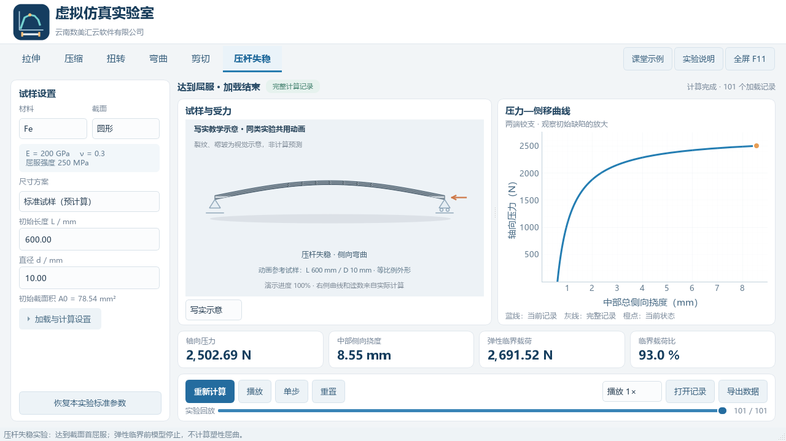
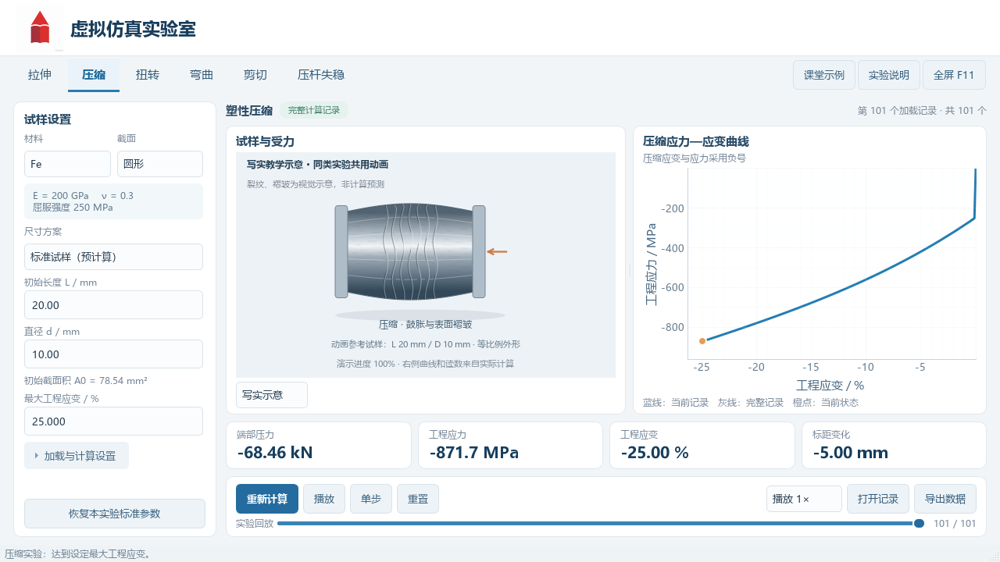

# 虚拟仿真实验室 · 2.1

A virtual simulation laboratory designed for teaching mechanics of materials, with a Python desktop platform and a C++ finite-element core.

面向材料力学课堂的 Windows 离线桌面程序，包含拉伸、压缩、扭转、弯曲、剪切、压杆失稳六类实验。支持圆形/矩形截面、Fe/Al 教学材料和24份标准试样记录，也可手动输入尺寸重新计算。

## 下载与安装

从 [最新发布页](https://github.com/SpringTai/Virtual-Simulation-Laboratory/releases/latest) 下载 **MechanicsVirtualLab-v2.1-Windows-x64-offline.zip**，完整解压后双击 `install.cmd`，选择安装位置。也可直接运行解压目录中的 `TensileLab/TensileLab.exe`。

安装包自带运行环境，不需要另装 Python、C++ 编译器或联网。升级前请关闭程序。GitHub 自动生成的 Source code 压缩包只包含源码，课堂使用请选择上述 Windows 离线安装包。

## 本版更新

- Python 负责界面、实验调度和数据处理；C++ 承担矩形轴向时间步、材料更新及部分结构矩阵组装。
- “写实示意 / 网格云图”可即时切换。不同实验使用各自标准试样的真实长径比：压杆失稳为60∶1细长杆，压缩为2∶1短粗试样。同类实验调整尺寸时仍共用其参考动画。
- 写实模式加入金属表面、颈缩、裂纹、褶皱等教学视觉细节；网格模式保留真实计算位移和场值。
- 安装目录可选，更新与卸载保留用户自行导出的数据。
- 已移除旧版文件、原型数据及旧说明。未增加混凝土或土力学实验。





写实动画是2.5D教学示意，裂纹和褶皱不是数值预测；曲线和读数始终来自实际计算。当前矩形轴向小模型已有 Numba 加速，本轮 C++ 实现尚未整体超过 Numba，不宣称全程序提速。

## 从源码运行

使用 Windows x64、CPython 3.12。在仓库目录执行：

```powershell
py -3.12 -m venv .venv-dev
.\.venv-dev\Scripts\python.exe -m pip install -r requirements-lock.txt
.\.venv-dev\Scripts\python.exe -m pip install -r requirements-build.txt
.\.venv-dev\Scripts\python.exe native/build.py
.\.venv-dev\Scripts\python.exe main.py
```

`native/build.py` 使用固定版本的 Zig/Clang 在 Windows 编译 C++ DLL。源码仓库不包含本机虚拟环境、编译缓存或大型安装包。需要提前准备离线构建依赖时：

```powershell
.\.venv-dev\Scripts\python.exe -m pip download -r requirements-lock.txt -r requirements-build.txt -d offline_packages
```

## 验证与构建

```powershell
.\.venv-dev\Scripts\python.exe tests/verify_native.py
.\.venv-dev\Scripts\python.exe tests/verify_structural.py
.\.venv-dev\Scripts\python.exe tests/verify_visual_styles.py
.\.venv-dev\Scripts\python.exe main.py --self-test verification-output/v2.1/source/report.json
powershell -NoProfile -ExecutionPolicy Bypass -File build.ps1
```

原生回归覆盖16组后端比较；桌面自检覆盖24份回放、12组重算和CSV/PNG/NPZ导出；两种显示风格覆盖72个界面状态。当前发布物输出到 `release-v2.1` 和根目录的2.1离线 ZIP。

## 模块与适用范围

- `tensile_lab/`：Python 平台、统一计算入口、数据记录与界面。
- `native/`：C++ 核心及编译入口；通过版本化 C ABI 连接 NumPy 缓冲区。
- `examples/`：24份当前标准试样记录。
- `packaging/`：安装、卸载及构建辅助脚本。
- `tests/`：数值、可视化和发布验证。
- `third_party_licenses/`：依赖许可声明。

圆棒轴向核心保留 Numba 大变形轴对称有限元；矩形轴向为非线性杆单元；扭转、弯曲采用杆梁模型，剪切采用均匀剪切模型，压杆失稳采用梁几何刚度特征值与临界前缺陷响应。Fe/Al为教学代表参数。具体假设与限制见[模型与数据说明](模型与数据说明.md)。

详细信息：[使用说明](使用说明.txt) · [2.1改造说明](改造说明-v2.1.md) · [验收记录](验收记录-v2.1.md)。Logo采用项目提供的宏辰教育图像。
