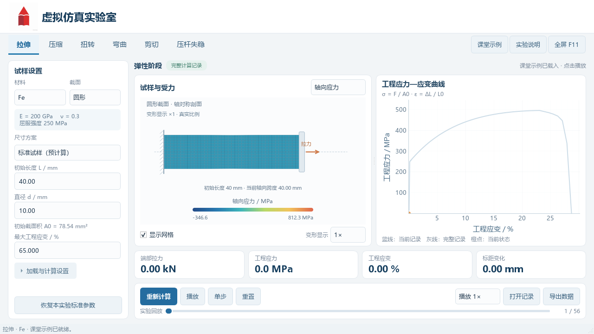
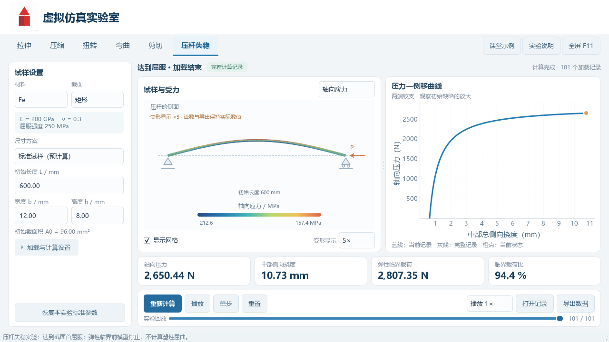

# 虚拟仿真实验室

A virtual simulation laboratory designed for teaching mechanics of materials.

面向材料力学课堂的 Python 离线桌面实验室，包含**拉伸、压缩、扭转、弯曲、剪切、压杆失稳**六类实验。支持**圆形和矩形截面**、**Fe 和 Al**两组教学材料参数，内置 **24 份标准试样记录**，也可手动输入尺寸重新计算。



## 下载与安装

普通课堂使用请到 [Releases 下载区](https://github.com/SpringTai/Virtual-Simulation-Laboratory/releases/latest) 下载 **MechanicsVirtualLab-v2-Windows-x64-offline.zip**。

1. 完整解压 ZIP。
2. 打开解压后的文件夹，双击 `install.cmd`。
3. 安装完成后，双击桌面“力学虚拟实验室”快捷方式。

安装包自带运行环境和标准实验记录，安装与运行均可离线，不需要另行安装 Python。安装包为 Windows 64 位版本，已在 Windows 11 上验证。升级前先关闭正在运行的实验室。

详细步骤见 [使用说明.txt](使用说明.txt)。GitHub 自动提供的 **Source code** 压缩包是源码，课堂直接使用请选择上述带 `Windows-x64-offline` 的安装包。

## 课堂使用

- 在顶部切换六类实验，左侧选择材料、截面与尺寸方案。
- 选择“标准试样（预计算）”后直接播放，可暂停、单步或拖动回放滑块。
- 选择“手动尺寸”，输入长度及直径或宽、高，点击“开始计算”或“重新计算”。
- 动画区显示试样、受力与约束；变形放大倍数明确标注，曲线和导出数据始终保留实际数值。
- 点击“导出数据”保存曲线 CSV、场结果 CSV、曲线 PNG、参数 JSON 与完整回放 NPZ；“打开记录”可重新回放。

| 实验 | 曲线 | 计算模型 |
| --- | --- | --- |
| 拉伸 | 工程应力—工程应变 | 圆棒：轴对称大变形实体有限元；矩形：非线性杆单元，可展示局部变细与断裂 |
| 压缩 | 工程应力—工程应变 | 圆棒轴对称实体／矩形杆单元，无摩擦端部加载、横向自由膨胀 |
| 扭转 | 扭矩—转角 | Saint-Venant 扭转杆有限元，圆／矩形采用对应扭转常数 |
| 弯曲 | 载荷—跨中挠度 | 简支梁跨中集中载荷，Euler–Bernoulli 梁有限元 |
| 剪切 | 剪应力—剪应变 | 受约束均匀直接剪切单元 |
| 压杆失稳 | 轴压力—侧向挠度 | 梁几何刚度特征值与初始缺陷的临界前响应，矩形取弱轴 |

Fe、Al 是教学代表参数。矩形轴向模型不解析三维颈部应力；扭转、弯曲和剪切目前计算弹性阶段，失稳不预测屈曲后的承载过程。详细假设和参考资料见 [模型与数据说明](模型与数据说明.md)。



## 从源码运行

开发环境使用 **CPython 3.12、Windows x64**。在仓库目录中执行：

```powershell
py -3.12 -m venv .venv
.\.venv\Scripts\python.exe -m pip install -r requirements-lock.txt
.\.venv\Scripts\python.exe main.py
```

首次安装源码依赖需要联网。若需提前准备离线依赖：

```powershell
.\.venv\Scripts\python.exe -m pip download -r requirements-lock.txt -d offline_packages
```

`offline_packages` 与本机虚拟环境不提交到仓库。离线重建环境可使用 `rebuild_offline.ps1`；运行已发布的安装包不需要这些步骤。

## 验证与打包

```powershell
.\.venv\Scripts\python.exe main.py --self-test verification-output/selftest/report.json
.\.venv\Scripts\python.exe tests/verify_structural.py
.\.venv\Scripts\python.exe tests/review_structural_physics.py
powershell -NoProfile -ExecutionPolicy Bypass -File build.ps1
```

自检覆盖24份标准记录回放、12组重新计算、CSV／PNG导出和NPZ数组往返。打包产物位于 `dist-v2`、`release-v2`，最终安装ZIP在仓库根目录；这些生成文件已由 `.gitignore` 排除。验证摘要见 [验收记录](验收记录.md)。

## 项目结构

- `tensile_lab/`：界面、统一实验入口、计算模型、数据记录和导出。
- `examples/`：24份标准实验记录及兼容的初版拉伸记录。
- `assets/`：界面Logo与程序图标。
- `packaging/`：安装、卸载及打包辅助程序。
- `tests/`：结构模型的解析对照与独立数值核对。
- `示例_读取实验数据.py`：使用Python标准库读取导出数据的课堂示例。
- `third_party_licenses/`：随附依赖的许可证与声明。

Logo 采用项目提供的宏辰教育图像。
